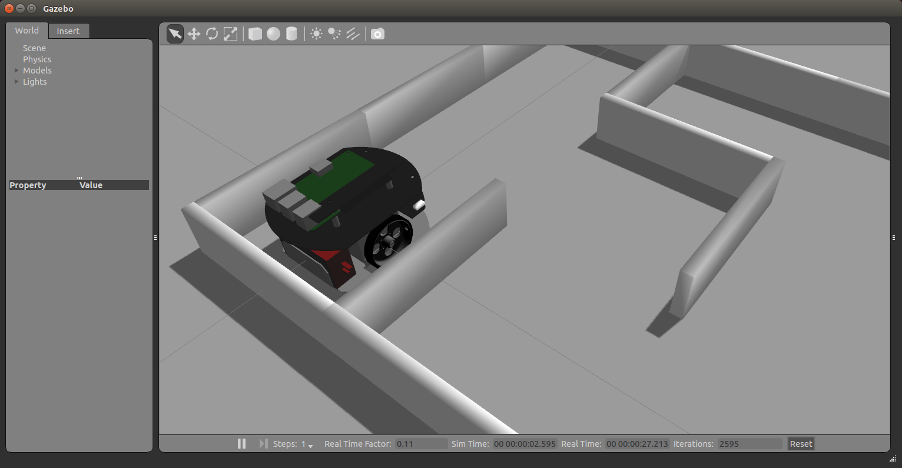

# ROSとは

ROSとはロボットの制御のために開発されたフレームワーク \(枠組み\) です。**R**obot **O**perating **S**ystemの頭文字をとった略称で「ロス」と読みます。 Operating Systemというキーワードを含みますが、Windows、macOS、UbuntuなどのコンピュータのOSとは違い、コンピュータのOSの上で動かすことができます。ソフトウェア開発者がロボット用のアプリケーションを作成する際に便利なライブラリとツールがセットになっています。 

ROSは多くがオープンソースで開発されており、ROS用のライブラリも豊富にあります。開発言語も様々で、自分がよく知る言語や目的に合わせた言語で開発ができます。またシミュレータと連携でき、シミュレータを使用した開発が可能です。本チュートリアルではこのシミュレータを活用してROSに触れていきます。

## ROS+ロボットシミュレータ

ROSは標準で**Gazebo**というシミュレータと連携できます。Gazeboとは物理演算エンジンを搭載した3Dのロボットシミュレータです。Gazeboもオープンソースソフトウェアとして開発されています。

Raspberry Pi Mouse SimulatorもGazeboを使用しています。

