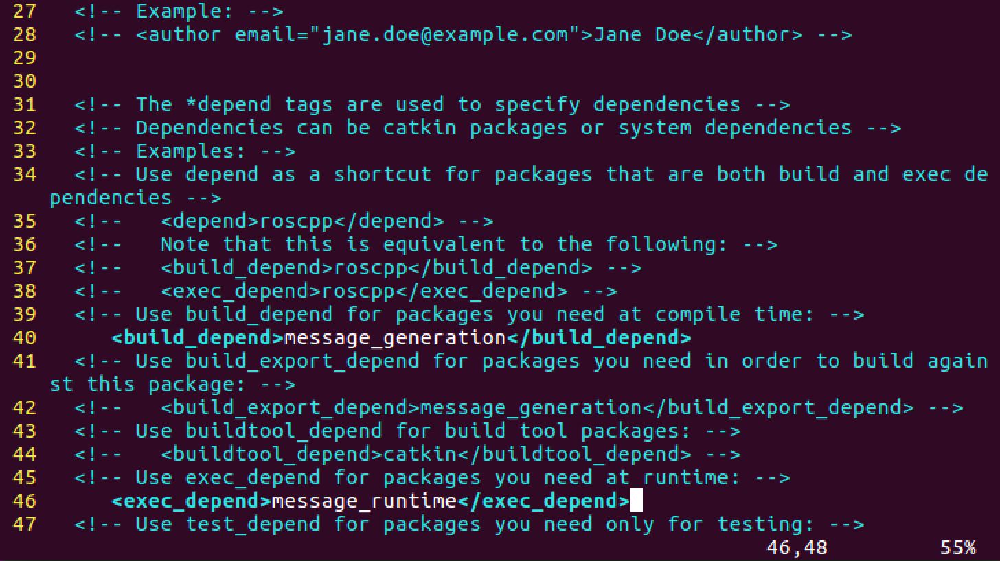
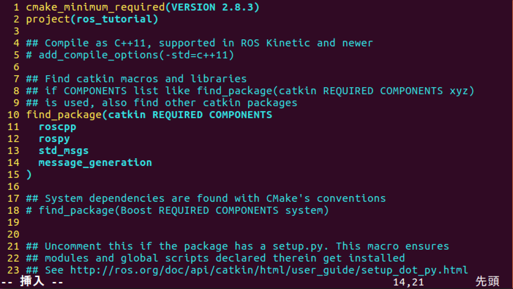
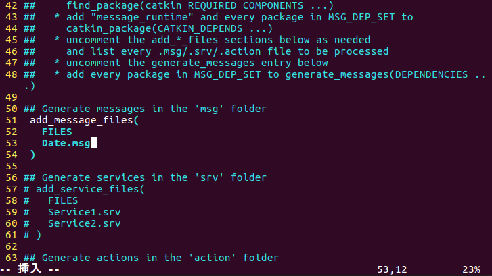
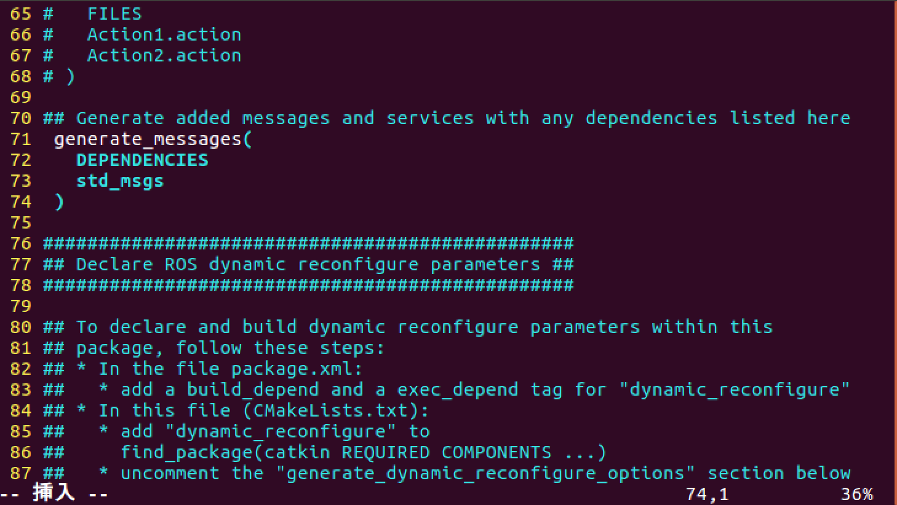
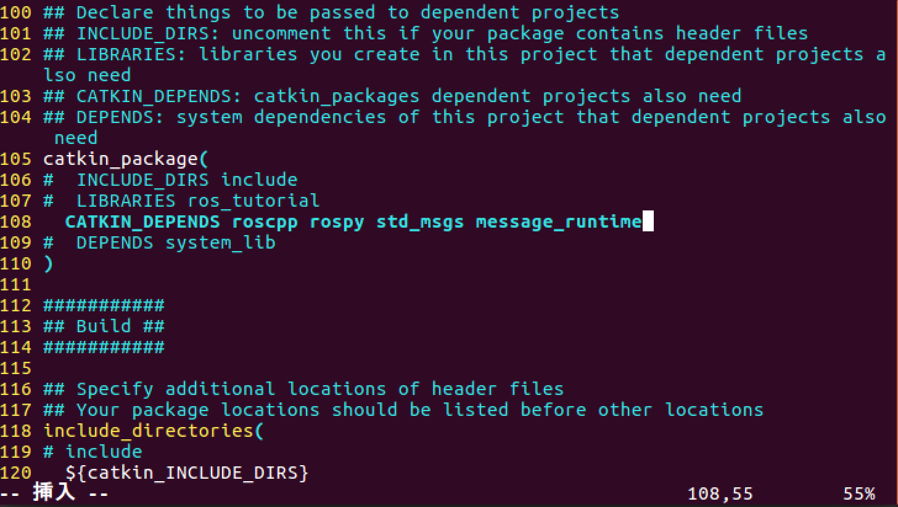

# 独自のメッセージファイルの作り方

## ROSチュートリアルの流れ

1. [ROSパッケージの作り方](how_to_create_pkg.md)
2. [トピックの書き方](how_to_write_topic.md)
3. [独自のメッセージファイルの作り方](how_to_create_msg.md) ←今ここ
4. [まとめて起動するやり方](how_to_use_launch.md)
5. [サービスを書き方](how_to_write_service.md)
6. [独自のサービスファイルの作り方](how_to_create_srv.md)

## はじめに

この章では、独自のメッセージファイルを作成し、ROSで使用する方法を解説します。

独自のメッセージファイルをROSで使用するためには、 `CMakeLists.txt`と`package.xml`というファイルを編集します。

この2つのファイルは、ROSチュートリアルの[ROSパッケージの作り方](how_to_create_pkg.md)でパッケージを作成したときに自動で出来たファイルです。 `package.xml`はパッケージの設定が書いてあり、`CMakeLists.txt`はビルドする際の設定が書いてあります。

[トピックの書き方](how_to_write_topic.md)ではUNIX時間を配信しましたが、この章では現在日時を送るものに改良したいと思います。

まず、現在日時を送るためのメッセージファイルから作成します。

## メッセージファイルの作り方

メッセージファイルは`msg`ディレクトリに置きます。 無い場合は`msg`ディレクトリを作りましょう。

```text
roscd ros_tutorial/
mkdir msg
```

日付と時間を送るためのメッセージを`Date.msg`とします。

```text
vim msg/Date.msg
```

`Date.msg`の中は以下のように書きます。

```text
int32 date
float64 time
```

1行目はint型32ビットの`date`で、2行目はFloat型の`time`という名前にしています。

#### ここからが**重要**です。

#### まず`package.xml`を編集します。

```text
roscd ros_tutorial/
vim package.xml
```

40行目の`<build_depend>message_generation</build_depend>`と、46行目の`<exec_depend>message_runtime</exec_depend>`のコメントアウトを外します。



#### 次に`CMakeLists.txt`を編集します。

```text
vim CMakeLists.txt
```

10行目の`find_package`に、14行目ように`message_generation`を追加します。



51行目の`add_message_files`のコメントアウトを外し、53行目に`Date.msg`を追加する。



71行目から74行目の`generate_massages`のコメントアウトを外します。



108行目の`catkin_package`の`CATKIN_DEPENDS`のコメントアウトを外し、`message_runtime`を追加します。



`catkin_ws`に移動し`catkin_make`を行います。

```text
cd ~/catkin_ws
catkin_make
```

これで、ビルドが通れば正常に`Date.msg`が作成されたはずです。

確認してみましょう。 以下のように打ち込み、

```text
rosmsg show ros_tutorial/Date
```

以下のように表示されたら完了です。

```text
int32 date
float64 time
```

## プログラムを改良

先程作成したメッセージファイルを使用して、プログラムを改良しましょう。 まず`ros_tutorial`に移動します。

```text
roscd ros_tutorial
```

### パブリッシャ

`time_pub2.py`という名前にします。

```text
vim scripts/time_pub2.py
```

```text
#!/usr/bin/env python                                                           
import rospy
from ros_tutorial.msg import Date    
from datetime import datetime

def talker():
    l = []
    d = Date()
    rate = rospy.Rate(10)
    while not rospy.is_shutdown():
        d.date = ''
        d.time = ''

        now = datetime.now()
        l = str(now)

        for i in range(0,10):
            d.date += l[i]
        for i in range(11,25):
            d.time += l[i]
        d.date = int(d.date.replace('-', ''))
        d.time = float(d.time.replace(':',''))
        pub.publish(d)
        rate.sleep()

if __name__ == '__main__':
    rospy.init_node('time_pub')
    pub = rospy.Publisher('Date_and_Time', Date , queue_size=1)
    talker()
    rospy.spin()
```

実行権限を与えます。

```text
chmod +x scripts/time_pub2.py
```

### コード解説

```text
#!/usr/bin/env python                                                           
import rospy
from ros_tutorial.msg import Date
from datetime import datetime
```

新たに、先程作成した`Date`をインポートしています。また現在日時を取得するために必要なモジュール`datetime`もインポートしています。 

```text
def talker():
```

`talker`という名前の関数を定義しています。

```text
    l = []
    d = Date()
```

`l = []`はリストの初期化を行っています。

`d = Date()`はメッセージの`Date`を`d`という名前でインスタンス化しています。

```text
    rate = rospy.Rate(10)
    while not rospy.is_shutdown():
```

シャットドウンされるまで10Hzでwhile内のコードを実行します。

```text
        d.date = ''
        d.time = ''
```

`Date.msg`の`date`と`time`を初期化しています。

```text
        now = datetime.now()
        l = str(now)
```

現在日時を取得し、配列にして`l`に渡しています。

```text
        for i in range(0,10):
            d.date += l[i]
        for i in range(11,25):
            d.time += l[i]
```

for文で配列の0~10番目を日付として`date`に渡しています。同様に配列の11~25番目を時間として`time`に渡しています。

しかし、このままだと`-`や`:`の文字が含まれているため、

```text
        d.date = int(d.date.replace('-', ''))
        d.time = float(d.time.replace(':',''))
        pub.publish(d)
        rate.sleep()
```

`replace`を用いて`-`や`:`の文字を取り除き、`int`型と`float`型にしてパブリッシュしています。

### サブスクライバ

サブスクライバはほとんど変わらないため、`time_sub.py`をコピーし、`time_sub2.py`という名前で保存しましょう。

```text
#!/usr/bin/env python
import rospy
from ros_tutorial.msg import Date  #changed

def callback(message):
    print("date : %d , time : %f" % (message.date,message.time) )  #changed

if __name__ == "__main__":
    rospy.init_node('time_sub')
    sub = rospy.Subscriber('Date_and_Time', Date , callback)  #changed
    rospy.spin()
```

```text
chmod +x scripts/time_sub2.py
```

### コード解説

変更点だけ解説していきます。

```text
from ros_tutorial.msg import Date
```

`Date`をインポートしています。

```text
    print("date : %d , time : %f" % (message.date,message.time) )
```

`date`はint型のため`%d`、`time`はfloat型のため`%f`で表示しています。

```text
    sub = rospy.Subscriber('Date_and_Time', Date , callback)
```

トピック名をメッセージの型を`Date`に変更しています。

## 実行方法

それぞれ別のターミナルで実行しましょう。

```text
roscore
```

```text
rosrun ros_tutorial time_pub2.py
```

```text
rosrun ros_tutorial time_sub2.py
```

## 実行結果

```text
$ rosrun ros_tutorial time_sub2.py 
date : 20181108 , time : 224947.85194
date : 20181108 , time : 224947.95175
date : 20181108 , time : 224948.05449
date : 20181108 , time : 224948.15677
date : 20181108 , time : 224948.25193
date : 20181108 , time : 224948.35248
date : 20181108 , time : 224948.45211
date : 20181108 , time : 224948.55515
date : 20181108 , time : 224948.6551
date : 20181108 , time : 224948.75641
date : 20181108 , time : 224948.85298
date : 20181108 , time : 224948.9519
date : 20181108 , time : 224949.05382
date : 20181108 , time : 224949.15634
date : 20181108 , time : 224949.25606
date : 20181108 , time : 224949.35245
date : 20181108 , time : 224949.45277
date : 20181108 , time : 224949.55351
date : 20181108 , time : 224949.65224
date : 20181108 , time : 224949.75421
date : 20181108 , time : 224949.8536
date : 20181108 , time : 224949.95257
```

2018年11月08日の22時49分49.95257秒を指しています。

