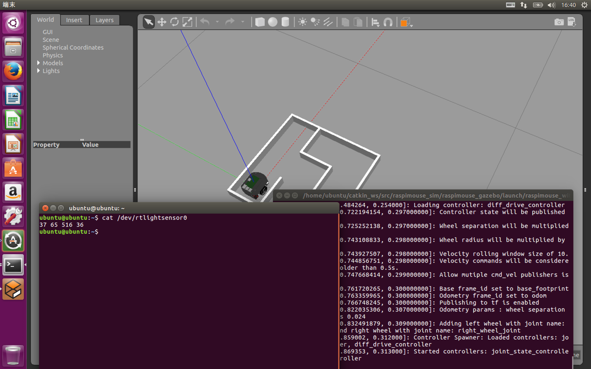
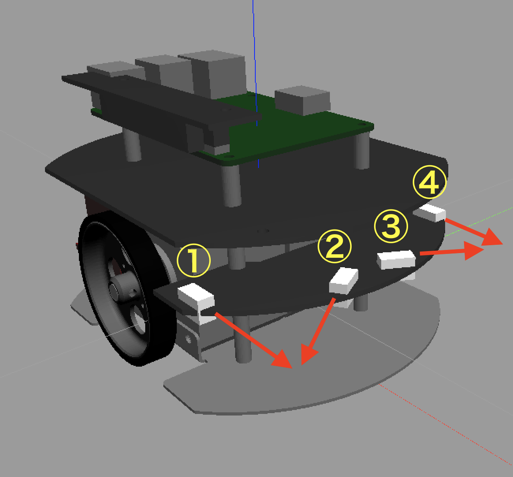
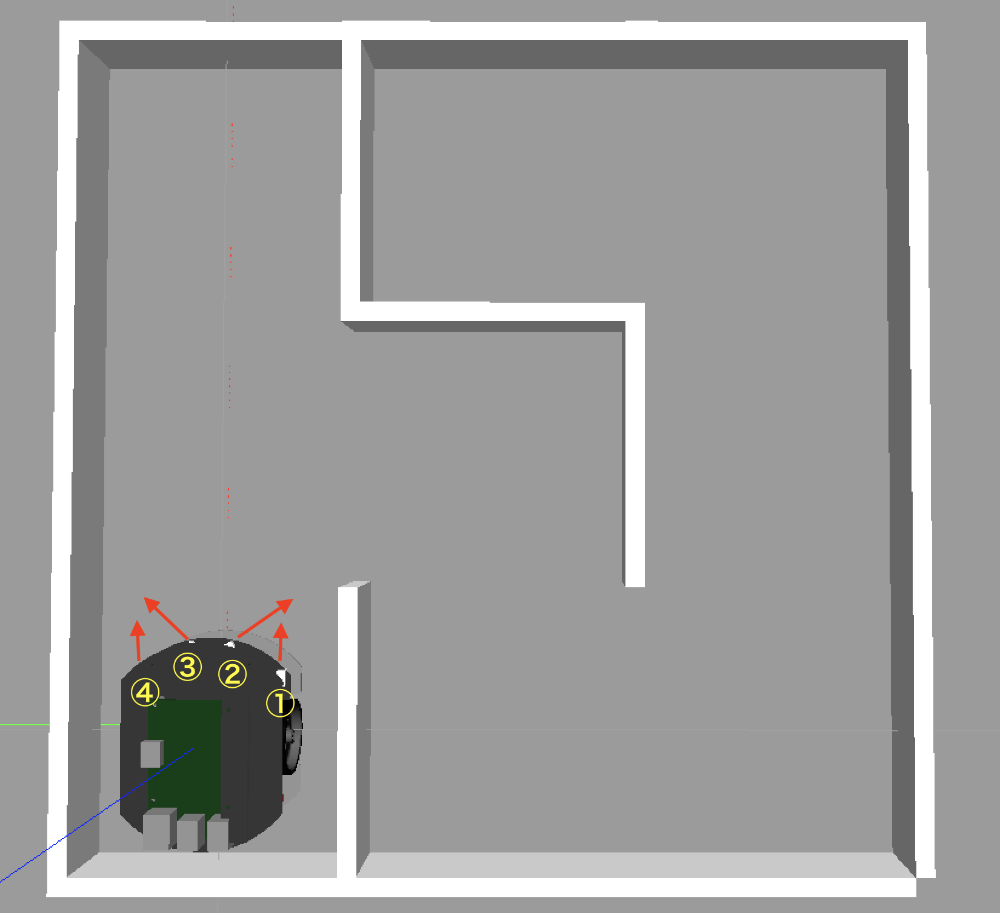

# シミュレータ上のラズパイマウスを動かす方法 Part1

## ラズパイマウスを動かすまでの流れ

シミュレータ上のラズパイマウスを動かす方法を複数回に分けて紹介していきます。

1. [距離センサの値の読み取り方](how_to_control_raspimouse_on_sim_1.md) ← 今ここ
2. [モータを動かし方](how_to_control_raspimouse_on_sim_2.md)
3. [キーボードを用いたラズパイマウスの動かし方](how_to_control_raspimouse_on_sim_3.md)
4. [コントローラを用いたラズパイマウスの動かし方](how_to_control_raspimouse_on_sim_4.md)

ラズパイマウスには距離センサが4つ付いています。この距離センサよりセンサ値を得ることができます。  
Part1では距離センサを使ってロボットと壁との距離を計測してみます。

## 距離センサから値を読み取る

まず、[Raspberry Pi Mouse Simulatorの動作確認](../setup/how_to_use_raspimouse_sim.md)に従い、Gazeboを起動します。

Gazeboが起動したら、2枚目のウィンドウで以下のコマンドを入力します。

```text
cat /dev/rtlightsensor0
```

この時、以下の画像のように`37 65 516 36`というバラバラの値が出てきていれば、正常に距離センサが動作しています。 

距離センサの値`37 65 516 36`は、左から`① ② ③ ④`とすると、以下の画像のように対応しています。 

起動したとき、ラスパイマウスの初期位置は以下の画像のようになっています。

距離センサは対象物との距離が小さいほど値が大きくなります。今回は③番のセンサが左側の壁を感知しているため、一番値が大きくなっています。 

## Trubleshooting

### Gazeboの動作がカクカクする/Gazeboのフレームレートが低い

描画が間に合っていない場合、Gazebo上のロボットの動きが鈍く見えます。  
陰を描画しないようにすることでほとんどの場合は動作が改善します。

詳しくは[ROSトラブルシューティング](https://github.com/yukixx6/raspimouse_sim_tutorial/tree/7041ca2f8b06749c8dcadd9ac1d69bc4e7277dc4/docs/source/troubleshooting.md)をご覧ください。

### rtlightsensorについてのエラー

```text
[ERROR] [1515648685.827463, 0.414000]: failed to open rtlightsensor0
```

上記のエラーが繰り返し出る場合、デバイスファイルが無いことがあります。

[ROSトラブルシューティング](https://github.com/yukixx6/raspimouse_sim_tutorial/tree/7041ca2f8b06749c8dcadd9ac1d69bc4e7277dc4/docs/source/troubleshooting.md)をご覧ください。

