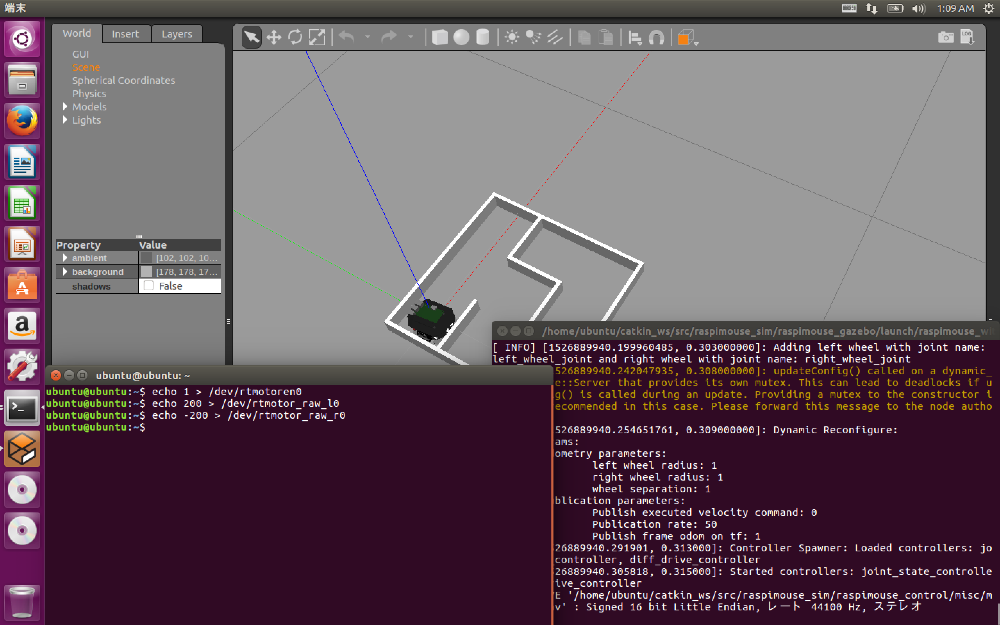

# シミュレータ上のラズパイマウスを動かす方法 Part2

## ラズパイマウスを動かすまでの流れ

1. [距離センサの値の読み取り方](how_to_control_raspimouse_on_sim_1.md)
2. [モータを動かし方](how_to_control_raspimouse_on_sim_2.md) ← 今ここ
3. [キーボードを用いたラズパイマウスの動かし方](how_to_control_raspimouse_on_sim_3.md)
4. [コントローラを用いたラズパイマウスの動かし方](how_to_control_raspimouse_on_sim_4.md)
5. [距離センサの値を利用したラズパイマウスの動かし方](how_to_control_raspimouse_on_sim_5.md)
6. [測域センサ\(URG\)を用いたSLAMの行い方](how_to_control_raspimouse_on_sim_6.md)

ラズパイマウスにはモータが2つあります。このモータに信号を送り、ロボットを動かすことができます。  
Part2ではモータの動かし方について取り扱います。

まず、Part1と同様に[Raspberry Pi Mouse Simulatorの動作確認](../setup/how_to_use_raspimouse_sim.md)に従い、Gazeboを起動します。

## モータの通電

次にモータを「通電」させます。

実機ではスイッチとは別に、デバイスファイルの操作によりモータの電源をON/OFFできます。

モータが通電していない場合、モータに信号を送っても回転せず、ラズパイマウスは動きません。

シミュレータでは実際に電流が流れているわけではありませんが、実機と同じ操作をすることで、モータに送った信号通りにシミュレータ上のモータが動くようになります。

次の操作で通電させることができます。

```text
echo 1 > /dev/rtmotoren0
```

モータが通電した場合、実機では特に音はなりませんが、シミュレータではわかりやすくするため**ピコ**という音がなります。  
（効果音は[効果音ラボ](https://soundeffect-lab.info/)さんからお借りしました。）


## ラズパイマウスを動かす

ROSを介さずシミュレータ上のラズパイマウスを動かすことができます。

```text
echo 200 > /dev/rtmotor_raw_l0
echo -200 > /dev/rtmotor_raw_r0
```

1行目は左モータに順方向に200Hz与えています。

2行目は右モータに逆方向に200Hz与えています。

2行目まで実行したとき、ラズパイマウスがその場で回転していたら正しく実行できています。 



## Trubleshooting

### Gazeboの動作がカクカクする/Gazeboのフレームレートが低い

描画が間に合っていない場合、Gazebo上のロボットの動きが鈍く見えます。  
陰を描画しないようにすることでほとんどの場合は動作が改善します。

詳しくは[ROSトラブルシューティング](../troubleshooting.md#gazebonogakakukakusurugazebonofurmurtogai)をご覧ください。

### rtlightsensorについてのエラー

```text
[ERROR] [1515648685.827463, 0.414000]: failed to open rtlightsensor0
```

上記のエラーが繰り返し出る場合、デバイスファイルが無いことがあります。

[ROSトラブルシューティング](../troubleshooting.md#rtlightsensornitsuitenoergaru)をご覧ください。

