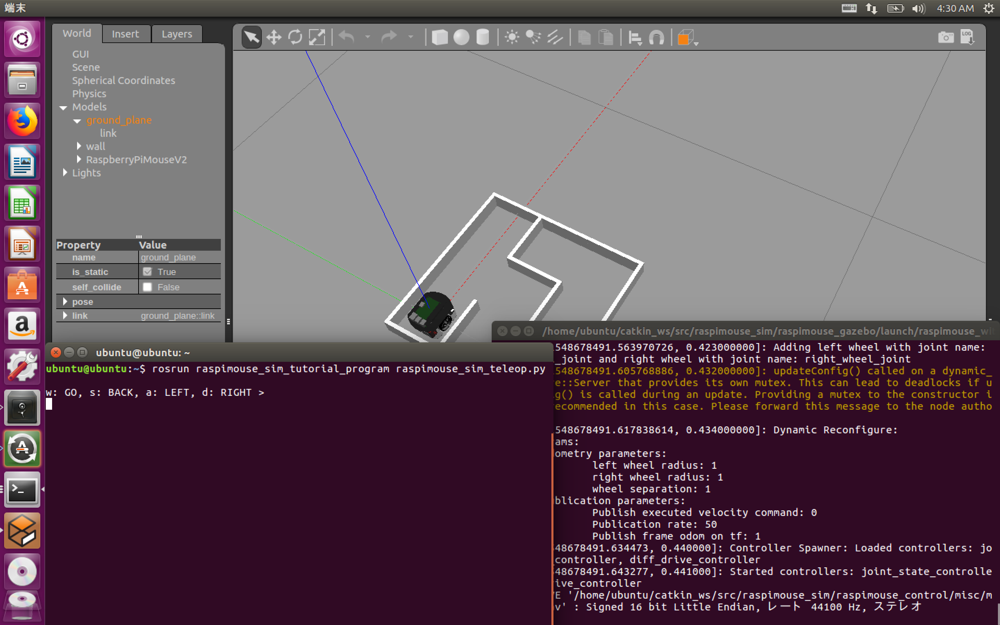

# シミュレータ上のラズパイマウスを動かす方法 Part3

## ラズパイマウスを動かすまでの流れ

1. [距離センサの値の読み取り方](how_to_control_raspimouse_on_sim_1.md)
2. [モータを動かし方](how_to_control_raspimouse_on_sim_2.md)
3. [キーボードを用いたラズパイマウスの動かし方](how_to_control_raspimouse_on_sim_3.md) ←今ここ
4. [コントローラを用いたラズパイマウスの動かし方](how_to_control_raspimouse_on_sim_4.md)
5. [距離センサの値を利用したラズパイマウスの動かし方](how_to_control_raspimouse_on_sim_5.md)
6. [測域センサ\(URG\)を用いたSLAMの行い方](how_to_control_raspimouse_on_sim_6.md)

Part3ではキーボードを用いてシミュレータ上のラズパイマウスを動かしましょう。

キーボードを用いてゲーム感覚で操作できます。

## キーボードでラズパイマウスを動かす

まず、前回と同様に[Raspberry Pi Mouse Simulatorの起動](https://github.com/yukixx6/raspimouse_sim_tutorial/tree/7041ca2f8b06749c8dcadd9ac1d69bc4e7277dc4/docs/source/how_to_use_raspimouse_sim/README.md)に従い、Gazeboを起動しましょう。

動かすためには`raspimouse_control` の `scripts` ディレクトリの中にある [`controller_vel_publisher.py`](https://github.com/rt-net/raspimouse_sim/blob/kinetic-devel/raspimouse_control/scripts/controller_vel_publisher.py) を使用します。

別のターミナルで以下のコマンドを実行しましょう。

```text
rosrun raspimouse_control controller_vel_publisher.py
```

すると次のようにキー入力待機状態になります。

```text
w: forward, s: backward, a: left, d: right >
```

よくあるゲームの移動方法と同じで `w` で前進、 `s` で後退、 `a` で左へ超信地旋回、 `d` で右へ超信地旋回できます。



## Trubleshooting

### Gazeboの動作がカクカクする/Gazeboのフレームレートが低い

描画が間に合っていない場合、Gazebo上のロボットの動きが鈍く見えます。  
陰を描画しないようにすることでほとんどの場合は動作が改善します。

詳しくは[ROSトラブルシューティング](../troubleshooting.md#gazebonogakakukakusurugazebonofurmurtogai)をご覧ください。

### rtlightsensorについてのエラー

```text
[ERROR] [1515648685.827463, 0.414000]: failed to open rtlightsensor0
```

上記のエラーが繰り返し出る場合、デバイスファイルが無いことがあります。

[ROSトラブルシューティング](../troubleshooting.md#rtlightsensornitsuitenoergaru)をご覧ください。

### vel\_publisherが起動しない

```text
Unable to register with master node [http://127.0.0.1:11311]: master may not be running yet. Will keep trying.
```

上記のようなメッセージが出て、コマンド入力状態にならないことがあります。

[ROSトラブルシューティング](../troubleshooting.md#master-may-not-be-running-yet)をご覧ください。

