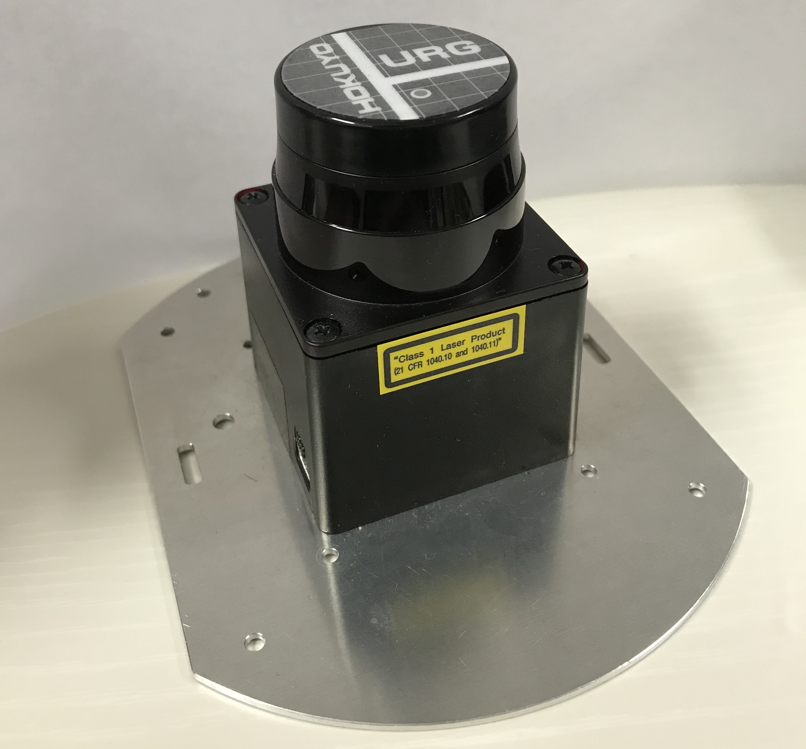
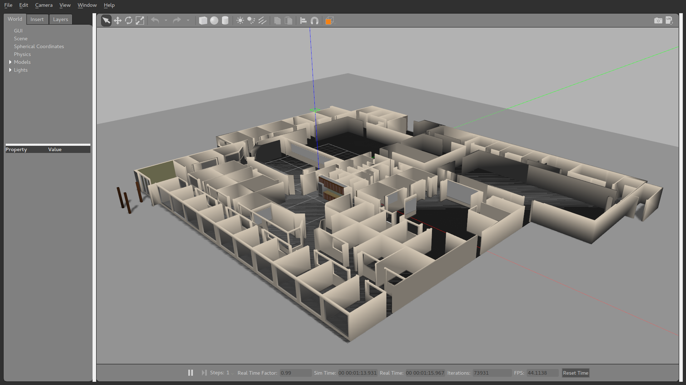
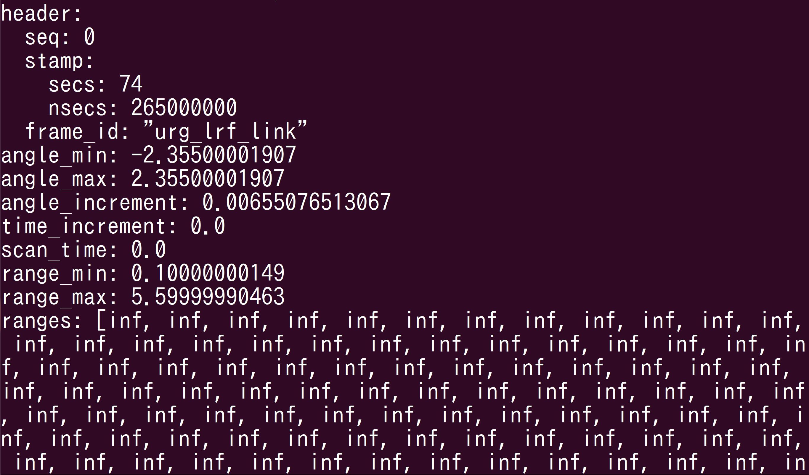
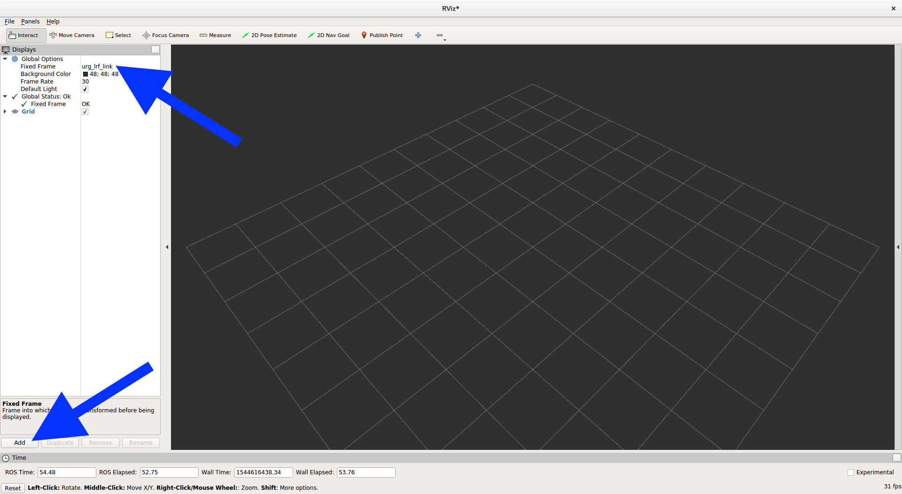
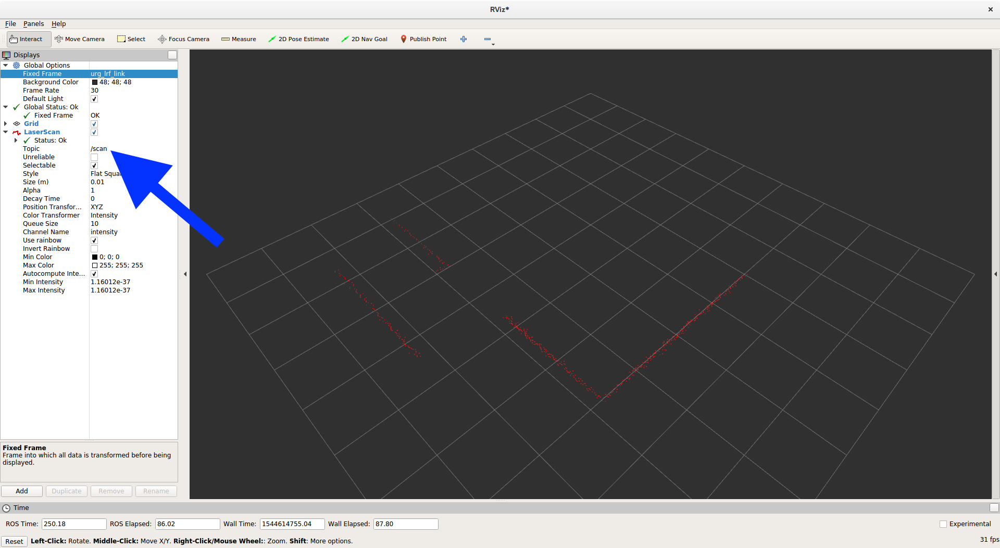
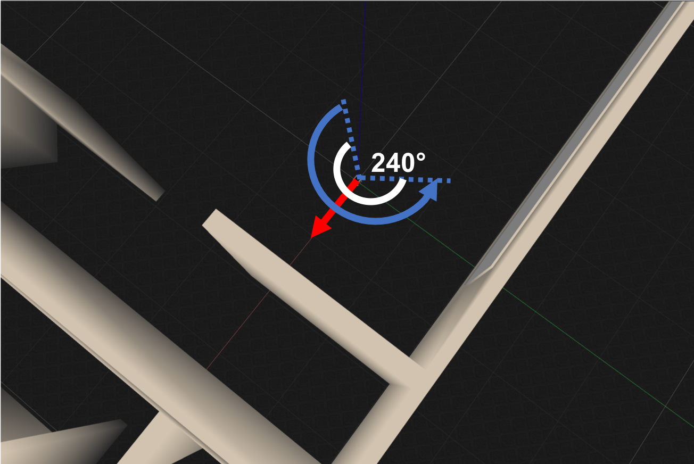
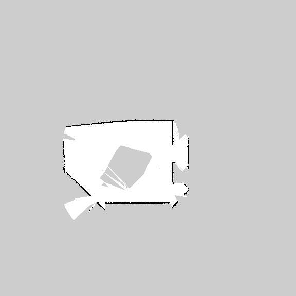

# シミュレータ上のラズパイマウスを動かす方法Part6

## ラズパイマウスを動かすまでの流れ

1. [距離センサの値の読み取り方](how_to_control_raspimouse_on_sim_1.md)
2. [モータの動かし方](how_to_control_raspimouse_on_sim_2.md)
3. [キーボードを用いたラズパイマウスの動かし方](how_to_control_raspimouse_on_sim_3.md)
4. [コントローラを用いたラズパイマウスの動かし方](how_to_control_raspimouse_on_sim_4.md)
5. [距離センサの値を利用したモータの動かし方](how_to_control_raspimouse_sim_5.md)
6. [測域センサ(URG)を用いたSLAMの行い方](how_to_control_raspimouse_sim_6.md)←今ここ

Part6では測域センサ(URG)を用いたSLAMの行い方について説明します。

URGとは、北陽電気株式会社さんから発売されている測域センサで、前方240°を検出できます。

公式サイト : [URG-04LX-UG01](https://www.hokuyo-aut.co.jp/search/single.php?serial=17)



## SLAMについて

SLAMとは、Simultaneous Localization and Mappingの略で、自己位置推定と地図生成を同時に行うものです。

SLAMにはLIDER(Light Detection and Ranging)呼ばれるセンサを使用します。
上記のURGもLIDERの一種です。

SLAMを行うときは<b>tf</b>と<b>scan</b>という2つのデータが必要になります。

### 大まかな流れ


### tf

ロボットを動かす上で必要になる、ロボットの位置姿勢や座標を変換したり配信してくれるプログラムです。
ロボットの移動量(odometry, odom)から座標変換したパラメータを使用します。
`tf`トピックで配信しています。

### scan

URGから取得できるセンサ値です。`scan`トピックで配信しています。

### SLAM

自己位置推定と地図生成を同時に行っています。
地図生成に関しては`tf`トピックと`scan`トピックから、地図を生成するための`map`データを生成しています。

### map_server

SLAMによって出来た`map`データから地図画像(`.pgm`)と地図データ(`.yaml`)を生成しています。
他に地図画像(`.pgm`)と地図データ(`.yaml`)より地図情報を`map`トピックで配信することが出来ます。

## 前準備

まずURGを動かすためのROSパッケージをインストールします。
すでに`urg_node`をインストールしている場合は行わなくて大丈夫です。

```
sudo apt install ros-kinetic-urg-node
```

次に、SLAMのROSパッケージをインストールします。

```
sudo apt install ros-kinetic-slam-gmapping
```

最後に`map_server`をインストールしましょう。

```
sudo apt install ros-kinetic-map-server
```

以上で準備完了です。

## トピックの確認

URGを使用するには先程インストールした`urg_node`が必要になりますが、Gazeboを起動すると同時に起動します。

<b>URG付きラズパイマウスは以下のコマンドで起動します。</b>

```
roslaunch raspimouse_gazebo raspimouse_with_willowgarage.launch
```



tfの相対座標変換の見てみましょう。

```
roslaunch raspimouse_ros_2 raspimouse.launch
rosrun rqt_tf_tree rqt_tf_tree 
```


`odom`から座標変換されて`base_link`になり、さらに座標変換して枝分かれしてることがわかります。
これらの情報を`tf`トピックは配信しています。

<br>

次にURGから配信されるセンサ値を確認してみましょう。

センサ値は`/scan`トピックで配信されます。

```
rostopic list
```

と打ち、`/scan`トピックがあることを確認し、

```
rostopic echo /scan
```

と打つと、数字がたくさん表示されると思います。

上に遡って見てみると以下のようになっています。



画像の<b> ranges: [inf,inf, ... ] </b>の部分がセンサ値になります。カンマで区切られている値1つ1つがセンサ値で、URGが検出できる前方240°分あります。

センサ値が大きいほどURGと壁や物との距離が遠く、値が小さいほど距離が近いです。また遠すぎすると<b>inf</b>(infinity)が出ます。

<br>

### センサ値の可視化

RvizというGUIツールを使用します。
Rvizの起動には以下のコマンドを使用します。

```
rviz rviz
```

起動したら、<b>Fixed Frame</b>の<b>urg_lrf_link</b>に変更します。

次に画面左下の<b>Add</b>を押し<b>By display type</b>の<b>LaserScan</b>を追加し、<b>Topic</b>を<b>/scan</b>にします。





起動時のシミュレータは以下の図のようになっています。
上のRvizの図と見比べると、赤い点群がシミュレータの壁と対応していることがわかります。



## gmappingのパラメータを設定

gmappingはSLAMのアルゴリズムの1つで、正確に地図作成するために様々なパラメータを設定する必要があります。パラメータはlaunchファイルに記述します。

今回は、`raspimouse_sim_gmapping.launch`という名前にします。

```raspimouse_sim_gmapping.launch
<launch>
 <include file="$(find raspimouse_game_controller)/launch/run_with_base_nodes.launch" />

<!-- <node pkg="urg_node" name="urg_node" type="urg_node" required="true" > -->
<!--  <param name="frame_id" value="base_link" /> -->
<!-- </node> -->

 <node pkg="rviz" type="rviz" name="rviz" args="-d $(find raspimouse_sim_tutorial_book_sample_program)/config/gmapping.rviz" /> 

 <node pkg="gmapping" type="slam_gmapping" name="slam_gmapping" output="screen">
  <param name="base_frame" value="base_link" />
  <param name="odom_frame" value="odom" />

  <param name="maxUrange" value="4.0" />
  <param name="maxRange" value="4.0" />

  <param name="xmin" value="-15" />
  <param name="ymin" value="-15" />
  <param name="xmax" value="15" />
  <param name="ymax" value="15" />

  <param name="srr" value="0.1" />
  <param name="srt" value="0.1" />
  <param name="str" value="0.1" />
  <param name="stt" value="0.1" />

  <param name="particles" value="30" />
 </node>
</launch>

```

### コード解説

```
 <include file="$(find raspimouse_game_controller)/launch/run_with_base_nodes.launch" />
```

チュートリアルの[コントローラを用いたラズパイマウスの動かし方](how_to_control_raspimouse_on_sim_4.md)で使用した、ロボットをコントローラで動かすためのlaunchファイルを起動しています。

```
<!-- <node pkg="urg_node" name="urg_node" type="urg_node" required="true" > -->
<!--  <param name="frame_id" value="base_link" /> -->
<!-- </node> -->
```

`urg_node` を起動するための記述ですが、
`urg_node`はGazeboの起動と同時に立ち上がるため、コメントアウトしています。

```
<node pkg="rviz" type="rviz" name="rviz" args="-d $(find raspimouse_sim_tutorial_book_sample_program)/config/gmapping.rviz" />
```

Rvizを起動します。
今回はgmapping用のRvizの設定([gmapping.rviz](https://github.com/yukixx6/raspimouse_sim_tutorial_book_sample_program/blob/add_slam/config/gmapping.rviz))を作っておいたので、こちらを使用します。

```
 <node pkg="gmapping" type="slam_gmapping" name="slam_gmapping" output="screen">
  <param name="base_frame" value="base_link" />
  <param name="odom_frame" value="odom" />

  <param name="maxUrange" value="4.0" />

  <param name="xmin" value="-15" />
  <param name="ymin" value="-15" />
  <param name="xmax" value="15" />
  <param name="ymax" value="15" />

  <param name="srr" value="0.1" />
  <param name="srt" value="0.1" />
  <param name="str" value="0.1" />
  <param name="stt" value="0.1" />

  <param name="particles" value="30" />
 </node>
```

ここでgmappingのパラメータの設定をしています。

`base_frame`はロボットのメインフレームで`base_link`、
`odom_frame`はオドメトリのフレームで`odom`を設定しています。

`maxUrange`でURGの最大測定範囲を設定しています。

`xmin`と`ymin`、`xmax`、`ymax`で地図の大きさを設定しています。

以下の4つはそれぞれオドメトリの誤差の設定をしています。この値が大きすぎても小さすぎても正確な地図は出来ません。今回はすべて0.1にしました。

`srr`：移動したときの移動の誤差

`srt`：移動したときの回転の誤差

`str`：回転したときの移動の誤差

`stt`：回転したときの回転の誤差

`particles`はパーティクルの数を設定しています。この値が大きいほど正確な地図ができやすいですが、計算量が増えます。今回はデフォルトの30にしました。

## SLAMを行う

まず以下の2つを起動させます。

```
roslaunch raspimouse_gazebo raspimouse_with_willowgarage.launch
```

```
roslaunch raspimouse_sim_tutorial_book_sample_program raspimouse_sim_gmapping.launch
```

起動したら、コントローラを使用してラズパイマウスを動かして地図を作っていきます。
初期位置にいる部屋を壁に沿って一周してみましょう。

## 実行結果


### 行っている様子
[youtube](https://youtu.be/PUY2l-049CE)
